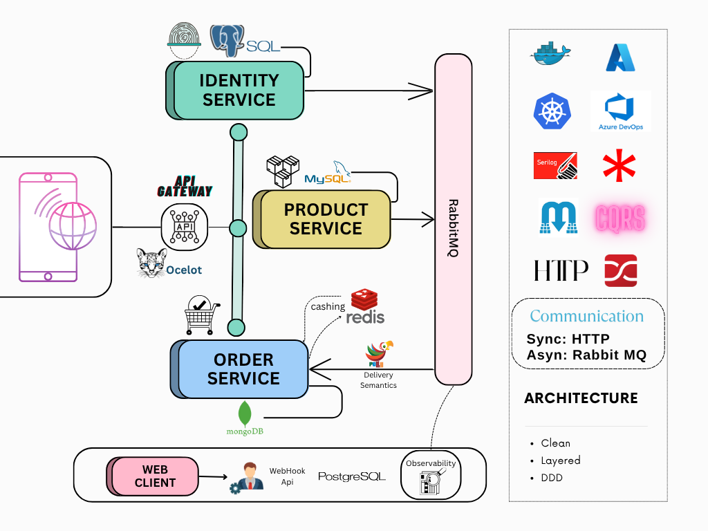

# E-TAILING INITIATIVE
A decentralized Q&A and discussion platform inspired by StackOverflow & Amazon, built with a scalable microservices architecture.
## System Design Diagram


## Config server
  - URL: http://localhost:8888

  - Service-specific config: http://localhost:8888/{service-name}/{profile}

  - Example: http://localhost:8888/posts/prod, http://localhost:8888/discovery.server/default

  Encryption CURL:
```
curl --location 'http://localhost:8888/encrypt' \
--header 'Content-Type: text/plain' \
--data 'Value to encrypt'
```

## Eureka service discovery
- URL: http://localhost:7777
- Post service shutdown curl:
```
curl --location --request POST 'http://localhost:3100/actuator/shutdown'
```
## API gateway
- URL: http://localhost:9999
- All routes: http://localhost:9999/actuator/gateway/routes
## Logging, Monitoring, Tracing
Monitoring
All the services has monitoring enabled, see config servers from below:
- Config server actuator monitoring URL(JSON): http://localhost:8888/actuator/metrics
- Config server actuator monitoring URL(PROMETHEUS): http://localhost:8888/actuator/prometheus
## Docker image build and push commands
- Config server
```
cd .\configserver\
docker build -t mhtanim2/micro_forum:config-server-1.2 .
cd ../
```
```
docker push mhtabim2/micro_forum:config-server-1.2
```

- Discovery server
```
cd .\discoveryserver\
docker build -t mhtanim2/micro_forum:discovery-server-1.0 .
cd ../
```
```
docker push mhtanim2/micro_forum:discovery-server-1.0
```
- Posts service
```
cd .\posts\
docker build -t mhtanim2/micro_forum:posts-1.0 .
cd ../
```
```
docker push mhtanim2/micro_forum:posts-1.0
```
- Notification service
```
cd .\notification\
docker build -t mhtanim2/micro_forum:notifications-1.0 .
cd ../
```
```
docker push mhtanim2/micro_forum:notifications-1.0
```
- API Gateway
```
cd .\gateway\
docker build -t mhtanim2/micro_forum:gateway-1.0 .
cd ../
```
```
docker push mhtanim2/micro_forum:gateway-1.0
```
